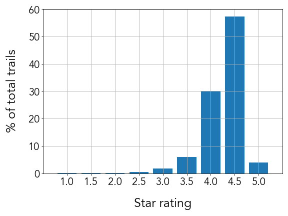

# Alltrails Recommender
Hiking is a good way to spend time, enjoy nature, and can even be a way to explore a new city. Especially this year, due to COVID, it has become even more popular as it is considered as one of the outdoor activities with relatively low potential risk. 

There are a few existing trails apps and websites that provide information about various trails in the US. When hikers are searching for new trails to hike on, they make decisions based on ratings from existing trail information on the web. 

The goal of this project is to understanding influential variables and relationships that affect rating of a trail using data from Alltrails.com.

## Table of Contents  
---
1. [Workflow](#workflow)  
2. [Exploratory Data Analysis](#exploratory-data-analysis)  
3. [Hypothesis Testing](#hypothesis-testing)

## Workflow  
Scraped HTML with Selenium and BeautifulSoup [[Link](./src/extract_html.ipynb)]

## Exploratory Data Analysis  

  
 
<b>Figure 1.</b> Histogram of star rating of trails in the US

## Hypothesis Testing
