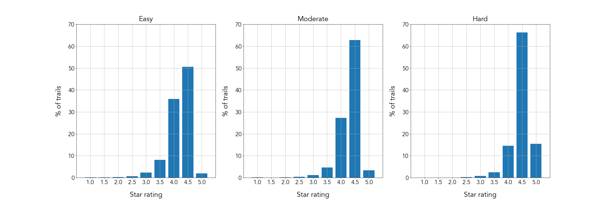

# Alltrails Recommender
Hiking is a good way to exercise and spend time with friends and family, while also enjoying the surrounding nature. There are a few existing applications and websites that provide information about various hiking trails in the US. When hikers search for new trails to hike on, these websites can be valuable resources with centralized information. While there is a wealth of information on these websites, it is still up to the users to look through various trails and make decision on which one to take on next.   

The goal of this project is to:  
1. Understand influential variables and relationships that affect trail rating  
2. Build a trail recommender that takes user’s favorite trail as an input and recommend top 5 trails that are similar to the user input

## Table of Contents  
---
1. [Workflow](#workflow)  
2. [Exploratory Data Analysis](#exploratory-data-analysis)  
3. [Hypothesis Testing](#hypothesis-testing)

## Workflow  

  
 
<b>Figure 1.</b> Project workflow for Alltrails recommender system

## Exploratory Data Analysis  

The trails star rating distribution is left skewed with over 91% of the trails having 4 or higher star ratings [Figure 2]. Less than 3% of the trails had 3 or less stars. This could be due to:   
1. the fact that trails are generally free (unlike goods and services which are paid)  
2. a self selection of people who go on hikes and write reviews on trail review app/website.  

  
 
<b>Figure 2.</b> Histogram of star rating of trails in the US

### How does the difficulty of trail affect star ratings?
  In order to understand how the difficulty of trail affects star rating, histogram of star rating is split into 3 groups by difficulty (i.e. easy, moderate, hard). While a star rating of 4.5 is the most prevalent rating in all three difficulty groups, the percentage of trails with 4.5 star rating increased with difficulty (easy 50.6%, moderate 62.9%, hard 66.4%). Additionally, the percentage of 5.0 star ratings was the highest for hard trails (15.4%), followed by moderate (3.37%) and easy (1.93%). The trails with 3 or less stars remained below 3.5% in all three groups. As a result, the average star rating value for easy, moderate, and hard trail groups are 4.19, 4.30, and 4.46, respectively. While this could seem counterintuitive, possible explanations are:  
  1. A self selection of people who would choose to go on difficult hikes  
  2. Nature/scenary that can be seen in more difficult trails  
  3. A greater sense of accomplishment/fulfillment felt by hikers after they finish difficult trails.

  
 
<b>Figure 3.</b> Histogram of star rating of trails by difficulty (easy, moderate, hard) 

&nbsp;  

### How does star ratings depend on geographic locations of trails?
  In order to understand the relationship between geographic location and star ratings, the trails were grouped by states and their average star rating was calculated. Figure 4 shows the average trail star rating for each state:
  

  
 
&nbsp;
<b>Figure 4.</b> Map of average star rating, average difficulty, and percentage of lowly rated trails by state 

&nbsp;  

From the star rating map, we can see that the states along the west and the east coasts have higher average trail ratings compared to central states. Average difficulty level also shows a similar trend, where trails in west and east coast states have higher average difficulty compared to the central states. The central states had higher percentage of trails that were rated 3.5 stars or below. This trend can be explained by the locations of the mountain ranges in the US [Figure 4]. Regions with major mountain ranges have trails with higher difficulty and higher star ratings, whereas regions marked with plains have less trails to offer.  
&nbsp;  

  
 
&nbsp;  
<b>Figure 5.</b> List of top 20 tag words from 5 states with highest and lowest average trail ratings

We can also look at the most frequently used tags in order to gain more insight into trails in these states. I have grouped them by states with top 5 and bottom 5 average star ratings and made a histogram of tag words. While many of the words in the list are similar for the two groups, the list from bottom 5 states have:   
1. The tag 'kid friendly' ranked as 4th most used tag vs 11th in the top 5 states list  
2. Tags like 'stroller friendly' and 'wheelchair friendly'  

These trends suggest that these state likely have flat and less challenging trails.

## Hypothesis Testing
1. Difficulty Level vs Average Star Rating

First, the one-way ANOVA test was conducted to test the null hypothesis below. Sample size, mean, and variance of each group is shown below:

H0: mean star rating for the groups (two for t-test, three for ANOVA) are the same     
Ha: mean star rating for the groups are not the same  
⍺ = 0.05  

  
 
&nbsp;  
<b>Table 1.</b> Stats for hypothesis testing 1 

Result:  
Using `scipy`, the returned F value was 778 and p-value was 0.0 (meaning that the probability is very small and is close to 0 practically.). Using a Welch's t-test (assuming non-equal population variance) for three pairs (easy, moderate), (moderate, hard), and (easy, hard), it is also shown that none of have the same mean star rating. This is as expected from the findings shown earlier, where the hard trails have more percentage of 4.5 and 5 star ratings compared to easy and moderate trails.

2. Route Type vs Average Star Rating

First, the one-way ANOVA test was conducted to test the null hypothesis. Sample size of each group is shown below:

  
 
&nbsp;  
<b>Table 1.</b> Stats for hypothesis testing 2 

  
 
&nbsp;  
<b>Table 2.</b> Stats for hypothesis testing 2 

H0: mean star rating for the groups (two for t-test, three for ANOVA) are the same   
Ha: mean star rating for the groups are not the same   
⍺ = 0.05  

Result:  
Using `scipy`, the returned F value was 116 and p-value was 7.9 x 10-51. Using a Welch's T-test (assuming non-equal population variance) for three pairs (loop, out & back), (loop, point to point), and (out and back, point to point), it is also shown we can reject the null hypothesis. Thus, the mean star rating for the different route types are not the same. Looking at the star rating distribution of the point to point trails, we see that there is higher percentage of 5 star trails in this group. Point-to-point trails are the trails with different start and end points, which are generally long distance trails. Similar to difficulty, it is possible that there could be a greater sense of achievement or some self-selection process of people who choose to go on these kind of hikes and review them.

