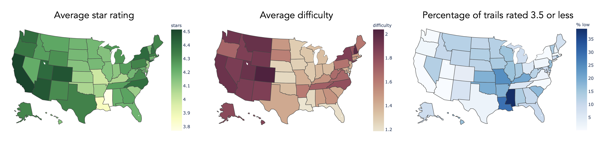

# Alltrails Recommender
Hiking is a good way to exercise and spend time with friends and family, while also enjoying the surrounding nature. There are a few existing applications and websites that provide information about various hiking trails in the US. When hikers search for new trails to hike on, these websites can be valuable resources with centralized information. While there is a wealth of information on these websites, it is still up to the users to look through various trails and make decision on which one to take on next.   

The goal of this project is to:  
1. Understand influential variables and relationships that affect trail rating  
2. Build a trail recommender that takes user’s favorite trail as an input and recommend top 5 trails that are similar to the user input

## Table of Contents  
---
1. [Workflow](#workflow)  
2. [Exploratory Data Analysis](#exploratory-data-analysis)  
3. [Hypothesis Testing](#hypothesis-testing)

## Workflow  

  
 
<b>Figure 1.</b> Project workflow for Alltrails recommender system

## Exploratory Data Analysis  

The trails star rating distribution is left skewed with over 91% of the trails having 4 or higher star ratings[Figure 2]. Less than 3% of the trails had 3 or less stars. This could be due to i) the fact that trails are generally free (unlike goods and services which are paid) ii) a self selection of people who go on hikes and write reviews on trail review app/website.  

  
 
<b>Figure 2.</b> Histogram of star rating of trails in the US

### How does the difficulty of trail affect star ratings?
  In order to understand how the difficulty of trail affects star rating, histogram of star rating is split into 3 groups by difficulty (i.e. easy, modreate, hard). While star rating of 4.5 is the most prevalent rating in all three difficulty groups, the percentage of trails with 4.5 star rating increased with difficulty (easy 50.6%, moderate 62.9%, hard 66.4%). Additionally, the percentage of 5.0 star rating was the highest for hard trails (15.4%), follwed by moderate (3.37%) and easy (1.93%). The trails with 3 or less stars remained below 3.5% in all three groups. As a result, the average star rating value for easy, moderate, and hard trail groups are 4.19, 4.30, and 4.46 respectively. While this coud seem counterintuitive, there can be i) a self selection of people who would choose to go on difficult hikes, ii) nature/scenary that can be seen in more difficult trails, or iii) a greater sense of accomplishment/fulfillment felt by hikers after they finish difficult trails.

  
 
<b>Figure 3.</b> Histogram of star rating of trails by difficulty (easy, moderate, hard) 

### How does star ratings depend on geographic locations of trails?
  In order to understand the relationship between geographic location and star ratings, the trails were grouped by states and their average star rating was calculated. Figure 4 shows the average trail star rating for each state:
  

  
 
&nbsp;
<b>Figure 6.</b> Map of average star rating, average difficulty, and percentage of lowly rated trails by state 

## Hypothesis Testing
